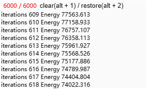

在浏览器中较为方便的打印高频日志,控制台打印日志较多时会导致控制台卡顿甚至卡死，用此插件可以较好的解决这个问题

使用方式
```js
const screenLog = new ScreenLog({
  maxCurrentViewLogs:10, // 最大显示日志条数
});
// 隐藏日志
screenLog.visible = false;
// 关闭头部提示
screenLog.hideTips = true;
```

使用效果

